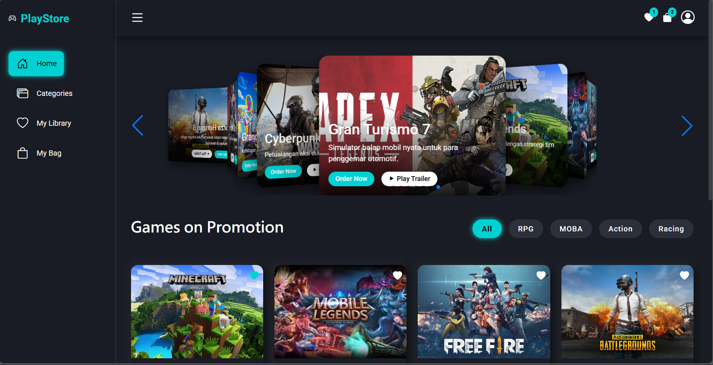

<<<<<<< HEAD
# 🎮 PlayStore Web App

PlayStore Web App adalah aplikasi web berbasis **React + Vite** yang menampilkan antarmuka navigasi dinamis dengan side menu interaktif. Proyek ini dirancang untuk melatih struktur komponen React, pengelolaan state, serta penggunaan Context API.

---




## ✨ Fitur Utama

- 📂 **Side Menu Interaktif**
  - Menu aktif berubah sesuai pilihan pengguna
  - Highlight otomatis pada item yang dipilih

- ⚛️ **Component-Based Architecture**
  - Struktur kode modular dan mudah dikembangkan
  - Pemisahan data, komponen, dan logika

- 🌐 **Global State dengan Context API**
  - Manajemen section/halaman secara global
  - Komunikasi antar komponen lebih rapi

- ⚡ **Vite Development Environment**
  - Build cepat
  - Hot Module Replacement (HMR)

---

## 🛠️ Teknologi yang Digunakan

- **React JS**
- **Vite**
- **JavaScript (ES6+)**
- **Context API**
- **Bootstrap Icons**
- **CSS**

---

## 📁 Struktur Folder

```bash
src/
│
├── components/
│   ├── SideMenu.jsx
│   ├── NavListItem.jsx
│   └── SideMenu.css
│
├── data/
│   └── navListData.js
│
├── App.jsx
└── main.jsx
=======
# game-store

>>>>>>> cc9189b2516acad038ba97cacc95518d2bfe8184
